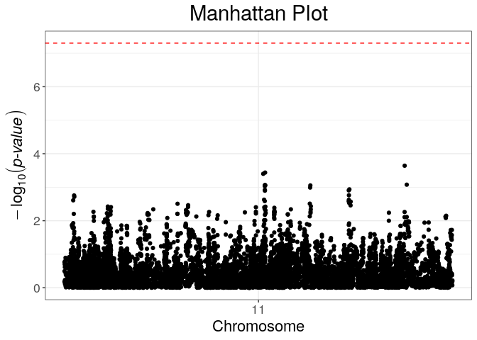
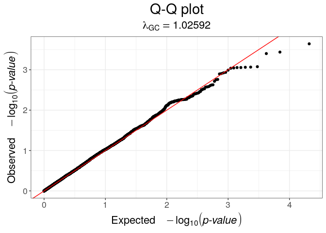

Sharing SNP genotype data with Robert Langefeld
================
Fred Boehm
3/30/23

``` r
nc <- 16
```

Goal is to create a csv file with, say, 10,000 subjects and up to 10,000
SNPs. It will also include a binary trait in the second column. The
first column has subject IDs.

I’ll share some of the UKB data, but I need to think about which
chromosome and which binary trait to use.

I’ll then use plink to subset the subjects and SNPs to get a set of
plink files with the desired number of subjects and SNPs.

From there, I’ll read the plink files into R and output a csv file.

Robert indicated that he wants the data to include a genomic region
where there is a strong association for the binary trait that I’ll
include in the csv.

To verify that there is an association signal in the csv file, I’ll do a
quick SNP association analysis.

Here, I download UKB summary statistics for essential hypertension
(I10). I then examine the p-values.

``` bash
wget https://broad-ukb-sumstats-us-east-1.s3.amazonaws.com/round2/additive-tsvs/I10.gwas.imputed_v3.both_sexes.tsv.bgz -O dat/I10.gwas.imputed_v3.both_sexes.tsv.bgz
```

Looking at the p-values should tell me where the strongest association
signal is.

``` r
library(magrittr)
dat <- vroom::vroom(here::here("dat", "I10.gwas.imputed_v3.both_sexes.tsv.bgz"))
```

    Rows: 13791467 Columns: 12
    ── Column specification ────────────────────────────────────────────────────────
    Delimiter: "\t"
    chr (2): variant, minor_allele
    dbl (9): minor_AF, expected_case_minor_AC, n_complete_samples, AC, ytx, beta...
    lgl (1): low_confidence_variant

    ℹ Use `spec()` to retrieve the full column specification for this data.
    ℹ Specify the column types or set `show_col_types = FALSE` to quiet this message.

``` r
dat %>%
    dplyr::filter(pval == min(pval, na.rm=TRUE)) %>%
    dplyr::select(variant)
```

    # A tibble: 1 × 1
      variant        
      <chr>          
    1 11:20414479:C:G

Make a fam file for use with plink. Column 6 must be the binary HTN
trait.

``` r
#pheno_b_all <- cbind(PRCA, TA, TD2, CAD, RA,
#                     BRCA, AS, MP, MDD, SS,
#                     QU, HT, FFI, DFI, OS,
#                     AN, GO, SAF, HA, TE,
#                     T1B, VMS, MY, SN, ES)
#save(pheno_b_all, file = paste0(comp_str, "02_pheno/05_pheno_b_clean.RData"))
# ABOVE CODE IS FROM SHENG YANG. IT TELLS US THE ORDERING OF THE TRAITS IN THE BINARY PHENOTYPE FILE.
load("/net/mulan/disk2/fredboe/research/ukb-intervals/02_pheno/05_pheno_b_clean.RData")
# loads an object called pheno_b_all
# HTN is column 12 per the list above
pheno_b_all %>% dim()
```

    [1] 337129     25

``` r
pheno_b_all[, 12] %>% table(useNA = "always")
```

    .
         0      1   <NA> 
    191829 108468  36832 

``` r
# read old fam file
old_fam_fn <- "/net/mulan/disk2/fredboe/research/ukb-intervals/hapmap3/chr11.fam"
fam <- vroom::vroom(old_fam_fn, col_names = FALSE) %>%
    dplyr::select(-X6) %>%
    dplyr::mutate(X6 = pheno_b_all[, 12])
```

    Rows: 337129 Columns: 6
    ── Column specification ────────────────────────────────────────────────────────
    Delimiter: " "
    dbl (6): X1, X2, X3, X4, X5, X6

    ℹ Use `spec()` to retrieve the full column specification for this data.
    ℹ Specify the column types or set `show_col_types = FALSE` to quiet this message.

``` r
fam %>%
    vroom::vroom_write(file = here::here("dat", "chr11.fam"), col_names = FALSE)
```

``` bash
original_bed=/net/mulan/disk2/fredboe/research/ukb-intervals/hapmap3/chr11.bed
original_bim=/net/mulan/disk2/fredboe/research/ukb-intervals/hapmap3/chr11.bim
# make sym links to original bed & original bim
ln -s -f ${original_bed} dat/chr11.bed
ln -s -f ${original_bim} dat/chr11.bim
```

``` r
# read chr11 bim file then create a file for desired snps
bim <- vroom::vroom(here::here("dat", "chr11.bim"), col_names = FALSE)
```

    Rows: 63603 Columns: 6
    ── Column specification ────────────────────────────────────────────────────────
    Delimiter: "\t"
    chr (3): X2, X5, X6
    dbl (3): X1, X3, X4

    ℹ Use `spec()` to retrieve the full column specification for this data.
    ℹ Specify the column types or set `show_col_types = FALSE` to quiet this message.

``` r
lower <- 10^7
upper <- 3 * 10^7
bim %>%
    dplyr::filter(X4 >= lower & X4 <= upper) %>%
    dplyr::select(X2) %>%
    vroom::vroom_write(col_names = FALSE, file = here::here("dat", "chr11.snps"))
# define my sample_n function
sample_n_nona <- function(dat, var, n, discard_na = TRUE){
    if(discard_na){
        dat <- dat %>%
            dplyr::filter(!is.na({{ var }}))
    }
    out <- dat %>%
        dplyr::filter({{ var }} != -9) %>% # -9 is the code for missing in plink files
        dplyr::sample_n(n) %>%
    return(out)
}

new_fam <- fam %>%
    sample_n_nona(var = X6, n = 10000) %>%
    dplyr::arrange(X1)
new_fam %>%
    dplyr::select(X1, X2) %>%
    vroom::vroom_write(col_names = FALSE, file = here::here("dat", "subjects_to_keep"))
```

``` bash
plink-1.9 --bfile dat/chr11 --keep dat/subjects_to_keep --extract dat/chr11.snps --make-bed --out dat/chr11.subset
```

``` r
# read in the subsetted bed file
bed_fn <- here::here("dat", "chr11.subset.bed")
rds_fn <- here::here("dat", "chr11.subset.rds")
if (!file.exists(rds_fn)){
    bed <- bigsnpr::snp_readBed()
    chr11 <- bigsnpr::snp_attach(bed)
} else {
    chr11 <- bigsnpr::snp_attach(rds_fn)
}

geno <- chr11$genotypes[] %>%
    tibble::as_tibble() %>%
    dplyr::mutate(pheno = chr11$fam$affection) %>%
    dplyr::relocate(pheno)
```

    Warning: The `x` argument of `as_tibble.matrix()` must have unique column names if
    `.name_repair` is omitted as of tibble 2.0.0.
    ℹ Using compatibility `.name_repair`.

``` r
vroom::vroom_write(geno, col_names = FALSE, file = here::here("dat", "chr11.csv"))
```

``` r
# verify associations in the small data set
# first, impute missing genotypes
foo <- bigsnpr::snp_fastImputeSimple(Gna = chr11$genotypes, ncores = nc)
bar <- chr11$fam$affection
bar[bar == -9] <- 0
gwas <- bigstatsr::big_univLogReg(X = foo, y = bar, ncores = nc)
```

``` r
CHR <- chr11$map$chromosome
POS <- chr11$map$physical.pos
bigsnpr::snp_manhattan(gwas = gwas, infos.chr = CHR, infos.pos = POS) +
    ggplot2::geom_hline(yintercept = -log10(5e-8), linetype = 2, color = "red")
```



``` r
bigsnpr::snp_qq(gwas = gwas)
```



``` r
devtools::session_info()
```

    ─ Session info ───────────────────────────────────────────────────────────────
     setting  value
     version  R version 4.2.3 (2023-03-15)
     os       Ubuntu 18.04.6 LTS
     system   x86_64, linux-gnu
     ui       X11
     language en_US:
     collate  en_US.UTF-8
     ctype    en_US.UTF-8
     tz       America/Detroit
     date     2023-03-30
     pandoc   1.19.2.4 @ /usr/bin/ (via rmarkdown)

    ─ Packages ───────────────────────────────────────────────────────────────────
     package      * version date (UTC) lib source
     bigassertr     0.1.6   2023-01-10 [1] CRAN (R 4.2.2)
     bigparallelr   0.3.2   2022-09-06 [1] Github (privefl/bigparallelr@714ed12)
     bigsnpr        1.12.2  2023-03-28 [1] CRAN (R 4.2.3)
     bigsparser     0.6.1   2022-06-07 [1] CRAN (R 4.2.0)
     bigstatsr      1.5.12  2022-10-14 [1] CRAN (R 4.2.2)
     bit            4.0.5   2022-11-15 [1] CRAN (R 4.2.2)
     bit64          4.0.5   2020-08-30 [2] CRAN (R 4.0.3)
     cachem         1.0.7   2023-02-24 [1] CRAN (R 4.2.3)
     callr          3.7.3   2022-11-02 [1] CRAN (R 4.2.2)
     cli            3.6.1   2023-03-23 [1] CRAN (R 4.2.3)
     codetools      0.2-19  2023-02-01 [1] CRAN (R 4.2.2)
     colorspace     2.1-0   2023-01-23 [1] CRAN (R 4.2.2)
     cowplot        1.1.1   2020-12-30 [2] CRAN (R 4.0.3)
     crayon         1.5.2   2022-09-29 [1] CRAN (R 4.2.1)
     data.table     1.14.8  2023-02-17 [1] CRAN (R 4.2.2)
     devtools       2.4.5   2022-10-11 [1] CRAN (R 4.2.2)
     digest         0.6.31  2022-12-11 [1] CRAN (R 4.2.2)
     doParallel     1.0.17  2022-02-07 [2] CRAN (R 4.2.0)
     doRNG          1.8.6   2023-01-16 [1] CRAN (R 4.2.2)
     dplyr          1.1.1   2023-03-22 [1] CRAN (R 4.2.3)
     ellipsis       0.3.2   2021-04-29 [2] CRAN (R 4.2.1)
     evaluate       0.20    2023-01-17 [1] CRAN (R 4.2.2)
     fansi          1.0.4   2023-01-22 [1] CRAN (R 4.2.2)
     farver         2.1.1   2022-07-06 [1] CRAN (R 4.2.3)
     fastmap        1.1.1   2023-02-24 [1] CRAN (R 4.2.3)
     flock          0.7     2016-11-12 [1] CRAN (R 4.1.1)
     foreach        1.5.2   2022-02-02 [2] CRAN (R 4.2.0)
     fs             1.6.1   2023-02-06 [1] CRAN (R 4.2.2)
     generics       0.1.3   2022-07-05 [1] CRAN (R 4.2.3)
     ggplot2        3.4.1   2023-02-10 [1] CRAN (R 4.2.2)
     glue           1.6.2   2022-02-24 [1] CRAN (R 4.2.0)
     gtable         0.3.3   2023-03-21 [1] CRAN (R 4.2.3)
     here           1.0.1   2020-12-13 [2] CRAN (R 4.1.1)
     htmltools      0.5.5   2023-03-23 [1] CRAN (R 4.2.3)
     htmlwidgets    1.6.2   2023-03-17 [1] CRAN (R 4.2.2)
     httpuv         1.6.9   2023-02-14 [1] CRAN (R 4.2.3)
     iterators      1.0.14  2022-02-05 [2] CRAN (R 4.2.0)
     jsonlite       1.8.4   2022-12-06 [1] CRAN (R 4.2.3)
     knitr          1.42    2023-01-25 [1] CRAN (R 4.2.3)
     labeling       0.4.2   2020-10-20 [2] CRAN (R 4.0.3)
     later          1.3.0   2021-08-18 [2] CRAN (R 4.1.1)
     lattice        0.20-45 2021-09-22 [2] CRAN (R 4.1.1)
     lifecycle      1.0.3   2022-10-07 [1] CRAN (R 4.2.2)
     magrittr     * 2.0.3   2022-03-30 [1] CRAN (R 4.2.0)
     Matrix         1.5-3   2022-11-11 [1] CRAN (R 4.2.3)
     memoise        2.0.1   2021-11-26 [1] CRAN (R 4.1.2)
     mime           0.12    2021-09-28 [2] CRAN (R 4.1.1)
     miniUI         0.1.1.1 2018-05-18 [2] CRAN (R 4.0.3)
     munsell        0.5.0   2018-06-12 [2] CRAN (R 4.0.3)
     pillar         1.9.0   2023-03-22 [1] CRAN (R 4.2.3)
     pkgbuild       1.4.0   2022-11-27 [1] CRAN (R 4.2.2)
     pkgconfig      2.0.3   2019-09-22 [2] CRAN (R 4.0.3)
     pkgload        1.3.2   2022-11-16 [1] CRAN (R 4.2.2)
     prettyunits    1.1.1   2020-01-24 [2] CRAN (R 4.0.3)
     processx       3.8.0   2022-10-26 [1] CRAN (R 4.2.2)
     profvis        0.3.7   2020-11-02 [1] CRAN (R 4.2.2)
     promises       1.2.0.1 2021-02-11 [2] CRAN (R 4.0.5)
     ps             1.7.3   2023-03-21 [1] CRAN (R 4.2.3)
     purrr          1.0.1   2023-01-10 [1] CRAN (R 4.2.2)
     R6             2.5.1   2021-08-19 [2] CRAN (R 4.1.1)
     Rcpp           1.0.10  2023-01-22 [1] CRAN (R 4.2.2)
     remotes        2.4.2   2021-11-30 [1] CRAN (R 4.1.2)
     rlang          1.1.0   2023-03-14 [1] CRAN (R 4.2.2)
     rmarkdown      2.21    2023-03-26 [1] CRAN (R 4.2.3)
     rngtools       1.5.2   2021-09-20 [2] CRAN (R 4.1.1)
     rprojroot      2.0.3   2022-04-02 [2] CRAN (R 4.2.0)
     scales         1.2.1   2022-08-20 [1] CRAN (R 4.2.3)
     sessioninfo    1.2.2   2021-12-06 [1] CRAN (R 4.1.2)
     shiny          1.7.1   2021-10-02 [2] CRAN (R 4.1.1)
     stringi        1.7.12  2023-01-11 [1] CRAN (R 4.2.2)
     stringr        1.5.0   2022-12-02 [1] CRAN (R 4.2.3)
     tibble         3.2.1   2023-03-20 [1] CRAN (R 4.2.3)
     tidyselect     1.2.0   2022-10-10 [1] CRAN (R 4.2.2)
     tzdb           0.3.0   2022-03-28 [2] CRAN (R 4.2.0)
     urlchecker     1.0.1   2021-11-30 [1] CRAN (R 4.2.2)
     usethis        2.1.6   2022-05-25 [1] CRAN (R 4.2.0)
     utf8           1.2.3   2023-01-31 [1] CRAN (R 4.2.3)
     vctrs          0.6.1   2023-03-22 [1] CRAN (R 4.2.3)
     vroom          1.6.1   2023-01-22 [1] CRAN (R 4.2.2)
     withr          2.5.0   2022-03-03 [1] CRAN (R 4.2.0)
     xfun           0.38    2023-03-24 [1] CRAN (R 4.2.3)
     xtable         1.8-4   2019-04-21 [2] CRAN (R 4.0.3)
     yaml           2.3.7   2023-01-23 [1] CRAN (R 4.2.3)

     [1] /net/mulan/home/fredboe/R/x86_64-pc-linux-gnu-library/4.0
     [2] /net/mario/cluster/lib/R/site-library-bionic-40
     [3] /usr/local/lib/R/site-library
     [4] /usr/lib/R/site-library
     [5] /usr/lib/R/library

    ──────────────────────────────────────────────────────────────────────────────
